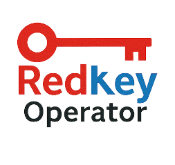

# Redkey Operator for Kubernetes

A **Redkey Cluster** is a key/value cluster using either [Redis Official Image](https://hub.docker.com/_/redis) or [Valkey Official Image](https://hub.docker.com/r/valkey/valkey/) images to create its nodes (note that all cluster nodes must use the same image).

**Redkey Operator** is the easiest way to deploy and manage a Redkey Cluster in Kubernetes implementing the [operator pattern](https://kubernetes.io/docs/concepts/extend-kubernetes/operator/).

This operator implements a controller that extends the Kubernetes API allowing to seamlessly deploy a Redkey cluster, monitor the deployed resources implementing a reconciliation loop, logging events, manage cluster scaling and recover from errors.

Redkey operator is built using [kubebuilder](https://github.com/kubernetes-sigs/kubebuilder) and [operator-sdk](https://github.com/operator-framework/operator-sdk).

## Features

- Redkey Cluster creation
- Cluster scaling up and down
- Cluster upgrading
  - Update node pods image
  - Update Redis configuration
  - Update node pods resources
- Ensure cluster health
- Slots allocation
- Ephemeral cluster (pure cache-like behavior) or using persistence
- RedisGraph support

## Documentation

Refer to [operator guide](./docs/operator-guide/toc.md) to have an overview of the main Redis configuration and management options, and a troubleshooting guide.

If you are a developer, you'll find interesting information in the [developer guide](./docs/developer-guide/toc.md).

Learn about [Redkey Cluster Status and Substatus](./docs/redkey-cluster-status.md).

Discover [Redkey Robin](./docs/redkey-robin.md).

The importance of the [purgeKeysOnRebalance](./docs/purge-keys-on-rebalance.md) parameter.

## Versions

- Go version: v1.24.6
- Operator SDK version: v1.37.0

## License

Copyright 2025 Inditex.

Licensed under the Apache License, Version 2.0 (the "License"); you may not use this file except in compliance with the License. You may obtain a copy of the License at <http://www.apache.org/licenses/LICENSE-2.0>

Unless required by applicable law or agreed to in writing, software distributed under the License is distributed on an "AS IS" BASIS, WITHOUT WARRANTIES OR CONDITIONS OF ANY KIND, either express or implied. See the License for the specific language governing permissions and limitations under the License.
