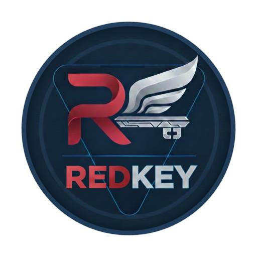

<!--
SPDX-FileCopyrightText: 2025 INDUSTRIA DE DISEÑO TEXTIL S.A. (INDITEX S.A.)

SPDX-License-Identifier: CC-BY-SA-4.0
-->

# Redkey Operator

Seamless Redkey Cluster Management on Kubernetes

[](LICENSE)
[](https://github.com/InditexTech/redkeyoperator/releases)
[](go.mod)
[](https://github.com/InditexTech/redkeyoperator/actions)

[](https://kubernetes.io/)
[](https://sdk.operatorframework.io/)
[](https://golang.org/)
[](https://reuse.software/)

[](https://github.com/InditexTech/redkeyoperator/issues)
[](https://github.com/InditexTech/redkeyoperator/pulls)
[](https://github.com/InditexTech/redkeyoperator/stargazers)
[](https://github.com/InditexTech/redkeyoperator/network/members)

[🚀 Quick Start](#quick-start) • [📖 Documentation](./docs) • [🤝 Contributing](./CONTRIBUTING.md) • [📝 License](./LICENSE)



---

## Overview

A **Redkey Cluster** is a key/value cluster built from either the [Redis official image](https://hub.docker.com/_/redis) or the [Valkey official image](https://hub.docker.com/r/valkey/valkey/). All nodes in the same cluster must use the same image family.

**Redkey Operator** deploys and manages Redkey clusters on Kubernetes by implementing the [operator pattern](https://kubernetes.io/docs/concepts/extend-kubernetes/operator/).

It extends the Kubernetes API with a controller that reconciles the desired state declared in the `RedkeyCluster` resource, manages the Kubernetes objects required by the cluster, coordinates Redis-side operations through Redkey Robin, and keeps the cluster healthy during lifecycle changes.

Redkey Operator is built using [kubebuilder](https://github.com/kubernetes-sigs/kubebuilder) and [operator-sdk](https://github.com/operator-framework/operator-sdk).

## Key Features

- Deploy Redkey clusters from a single `RedkeyCluster` custom resource using Redis or Valkey images
- Configure topology with a selectable number of primaries and replicas per primary
- Run ephemeral or persistent clusters with configurable storage size, storage class, access modes, and PVC cleanup behavior
- Scale clusters up and down while reassigning slots and preserving cluster balance
- Choose between fast operations and key-preserving rebalance flows through `purgeKeysOnRebalance`
- Roll out changes to node image, Redis configuration, and pod resources
- Continuously reconcile cluster state, surface status and substatus, and recover from unhealthy conditions
- Configure authentication, labels, PodDisruptionBudgets, and Kubernetes resource requests and limits
- Deploy and tune Redkey Robin for Redis-side orchestration, health supervision, and metrics collection
- Override generated StatefulSet and Service manifests for platform-specific customization
- Use RedisGraph-compatible images when the workload requires it

## Quick Start

### Using Helm Charts

Prerequisites:

- A running Kubernetes cluster (currently tested with Kubernetes v1.33)
- `kubectl` matching the cluster version
- Helm (v3.0+)

The project provides Helm charts to easily deploy the Redkey Operator and a sample Redkey Cluster. The charts are located in the `charts` directory of the repository.

Install the Redkey Operator using the provided Helm chart:

```bash
helm install redkey-operator ./charts/redkey-operator
```

Install a sample Redkey Cluster using the provided Helm chart:

```bash
helm install my-redkey-cluster ./charts/redkey-cluster
```

Take a look at the [charts/README.md](./charts/README.md) for more details on how to use the Helm charts, including how to enable the post-install hook in the redkey-cluster chart to wait for the cluster to be ready after installation.

### Using Makefile

Prerequisites:

- A running Kubernetes cluster (Kubernetes v1.33+ recommended)
- `kubectl` matching the cluster version
- Make
- Go 1.26.2 (project configured to install easily using asdf or mise)

The operator can be installed using the provided Makefile. The following steps will guide you through the installation and deployment of a sample Redkey Cluster. Redkey Operator can be installed in any namespace, but for this quick start we will use the `redkey-operator` namespace.

Clone the repository to your local machine:

```bash
git clone https://github.com/InditexTech/redkeyoperator.git
cd redkeyoperator
```

Generate and install the CRDs:

```bash
make install
```

Deploy the operator in the cluster (replace `${VERSION}` with the desired version, e.g., `0.1.0`; check the repo releases for available versions):

```bash
make deploy IMG=ghcr.io/inditextech/redkey-operator:${VERSION}
```

Create a Redkey Cluster (replace `${VERSION}` with the desired version, e.g., `0.1.0`; check the [Redkey Robin](https://github.com/InditexTech/redkeyrobin) repo releases for available versions):

```bash
make deploy-samples IMG_ROBIN=ghcr.io/inditextech/redkey-robin:${VERSION}
```

## Documentation

Discover the architecture and design of Redkey Operator in the [architecture document](./docs/architecture.md).

Refer to [operator guide](./docs/operator-guide/toc.md) to have an overview of the main Redis configuration and management options, and a troubleshooting guide.

If you are a developer, you'll find interesting information in the [developer guide](./docs/developer-guide/toc.md).

Learn about [Redkey Cluster Status and Substatus](./docs/redkey-cluster-status.md).

Discover [Redkey Robin](./docs/redkey-robin.md).

The importance of the [purgeKeysOnRebalance](./docs/purge-keys-on-rebalance.md) parameter.

Deploy the Operator in Kubernetes using [Operator Lifecycle Manager (OLM)](./docs/olm.md).

## Contributing

Contributions are welcome! Please read our [contributing guidelines](./CONTRIBUTING.md) to get started.

## Versions

The source of truth for the development toolchain lives in `go.mod`, `Makefile`, and `Dockerfile`.

- [Go](https://github.com/golang/go): 1.26.2
- [Operator SDK](https://github.com/operator-framework/operator-sdk): v1.42.2
- [Kubernetes Controller Tools](https://github.com/kubernetes-sigs/controller-tools): v0.18.0
- [Kustomize](https://github.com/kubernetes-sigs/kustomize): v5.6.0
- [Kind](https://github.com/kubernetes-sigs/kind): v0.22.0
- Kubernetes Go libraries (`k8s.io/*`) / envtest target: v0.33.0 / v1.33

## License

Copyright 2025 Inditex.

Licensed under the Apache License, Version 2.0 (the "License"); you may not use this file except in compliance with the License. You may obtain a copy of the License at <http://www.apache.org/licenses/LICENSE-2.0>

Unless required by applicable law or agreed to in writing, software distributed under the License is distributed on an "AS IS" BASIS, WITHOUT WARRANTIES OR CONDITIONS OF ANY KIND, either express or implied. See the License for the specific language governing permissions and limitations under the License.
