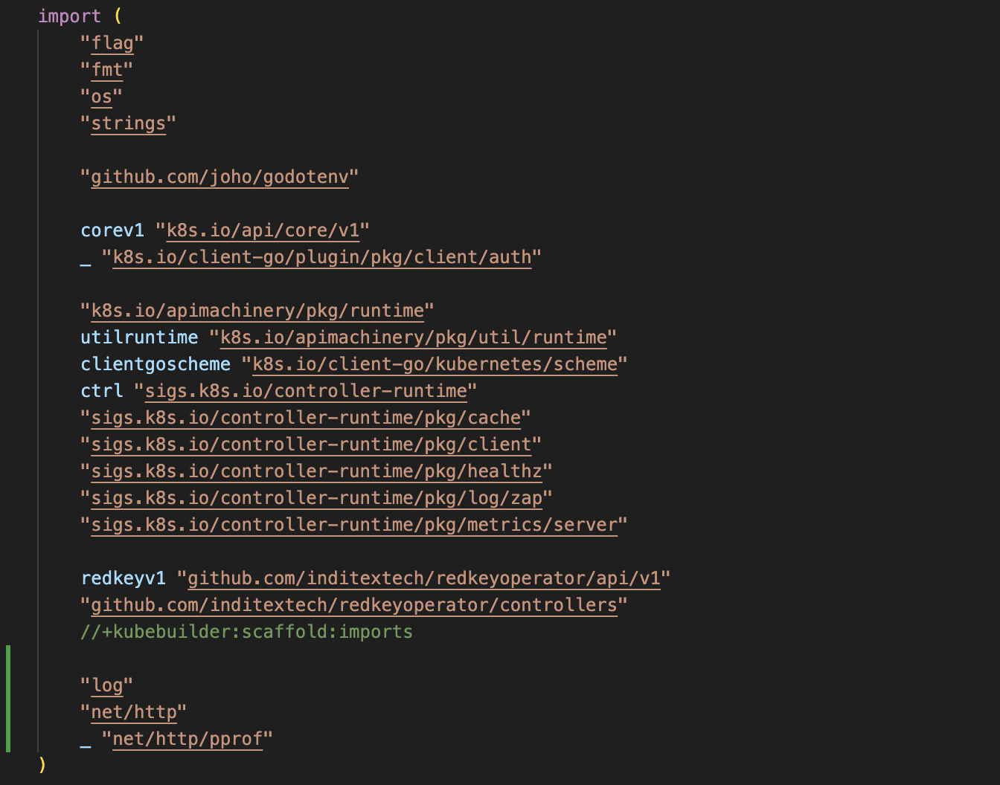
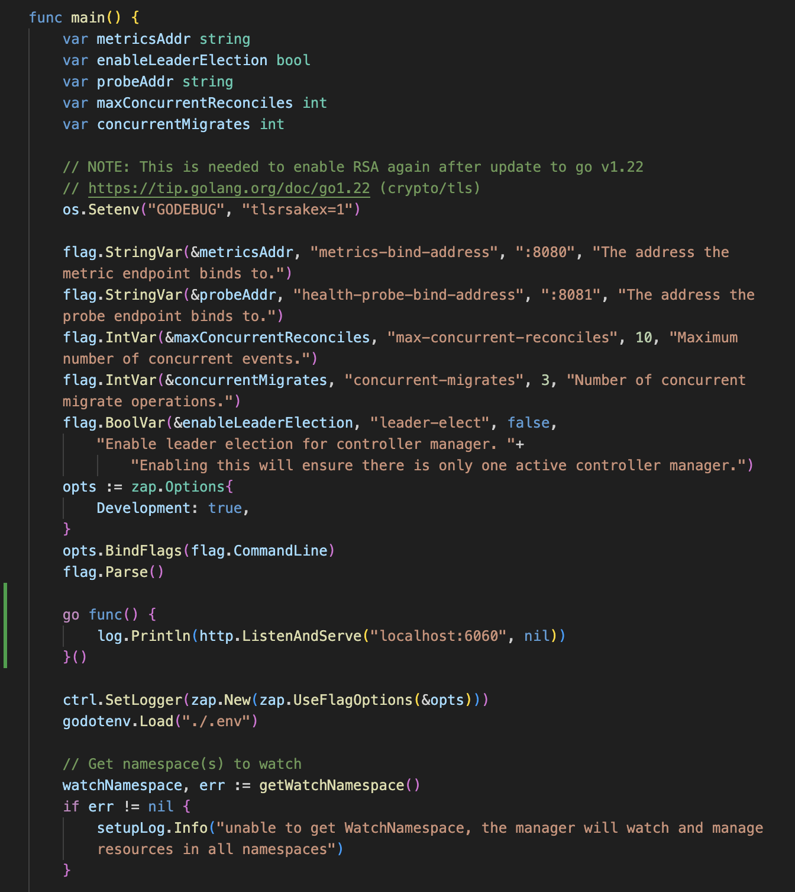

<!--
SPDX-FileCopyrightText: 2024 INDUSTRIA DE DISEÑO TEXTIL S.A. (INDITEX S.A.)

SPDX-License-Identifier: CC-BY-SA-4.0
-->

# Profiling Guide

The **Redkey Operator** must manage the Redkey Clusters the *most efficient way possible*. **Standard Go profiling tools** are used to analyze resource usage to help debugging high resources consumption problems and optimizing.

## Tools

The tools used include the folowwing:

- **pprof**: Go's built-in profiler for analyzing CPU, memory, goroutines and locks (https://github.com/google/pprof).
- **profefe**: a continuous profiling system, collects profiling data from a fleet of running applications and provides API for querying profiling samples for postmortem performance analysis (https://github.com/profefe/profefe).
- **kube-profefe*: Kube-profefe is a project that acts as a bridge between profefe and Kubernetes that offers a kubectl plugin and a cron-able executable that regularly sends profiling data to profefe (https://kubernetes.profefe.dev/).

## Modifying the Manager

In order to allow profiling data being availeble from Redkey Operator manager some changes must be made to the `main.go` file.

A Golang package is available (https://pkg.go.dev/net/http/pprof) that allows to easily serve via its HTTP server runtime profiling data in the format expected by the pprof visualization tool.

Even if the overhead of enabling pprof in the Redkey Operator manager is pretty limited (it just installs some handlers for the http server), we need to start an http server to make the data collected available, which will increment the required overhead. 

Therefore, we prefer not to activate this feature by default and instead manipulate the code when profiling tasks are to be performed, generating a development image of the Operator.

Two simple changes (highlighted in gree) are required in `cmd/main.go` file:

1. Add the required imports



2. Enable the http server



The next Operator image built using `make docker-build` will include profiling data serving at port 6060.

## Deploying the Modified Operator

Once the modified code is ready, a new Redkey Operator image must be built and deployed into the Kubernetes cluster.

Build and push the Redkey Operator image:

```shell
make docker-build
make docker-push
```

Once the Redkey Operator is available in your local registry, deploy it into your K8s cluster:

1. Delete the existing Redkey Operator.

```shell
make undeploy
```

2. Deploy the Redkey Operator with the profiling enabled image, using the profiling profile.

```shell
PROFILE=profiling make deploy
```

This will deploy the Redkey Operator with the profiling enabled image, exposing the profiling data at port 6060.

## Accessing Profiling Data
Once the Redkey Operator is running with the modified code, profiling data can be accessed using port-forwarding to the Operator pod.

```shell
kubectl port-forward <redkey-operator-pod-name> 6060:6060
```

Or using the provided Makefile target:

```shell
make port-forward-profiling
```

After that, profiling data can be accessed using pprof tool. For example, to get a CPU profile for 30 seconds:

```shell
go tool pprof http://localhost:6060/debug/pprof/profile?seconds=30
```

This will open an interactive terminal where different commands can be used to analyze the collected data. For example, the `top` command will show the functions consuming more CPU time.

To get a heap profile:

```shell
go tool pprof http://localhost:6060/debug/pprof/heap
```

This will open an interactive terminal where different commands can be used to analyze the collected data. For example, the `top` command will show the functions consuming more memory.

To visualize the profiling data using a web interface, the `web` command can be used. 

For example, to visualize the heap profile:

```shell
go tool pprof -http=:8080 http://localhost:6060/debug/pprof/heap
```

This will start a web server at port 8080 where the profiling data can be visualized using different graphs and charts.

The same approach can be used to get other types of profiling data, such as goroutine and block profiles. The available profiles can be listed using:

```shell
go tool pprof http://localhost:6060/debug/pprof/
```

>[!NOTE]
> Web visualization requires Graphviz to be installed on your system. Please refer to the [Graphviz installation guide](https://graphviz.org/download/) for more information.

## Continuous Profiling with Profefe

For continuous profiling, Profefe can be integrated with the Redkey Operator. This involves running a Profefe agent alongside the Redkey Operator to collect and send profiling data to a Profefe server.

The Profefe agent can be configured to collect profiling data at regular intervals and send it to the Profefe server for storage and analysis. This allows for continuous monitoring of the Redkey Operator's performance over time.

Instructions for setting up Profefe with Kubernetes can be found in the [Kube-profefe documentation](https://kubernetes.profefe.dev/).

The `profiling` profile used to deploy the Redkey Operator sets the necessary annotations to enable Profefe integration.
