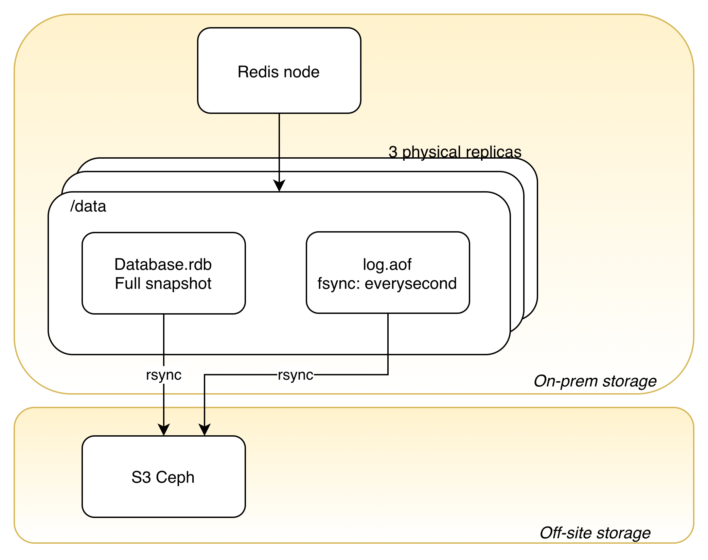
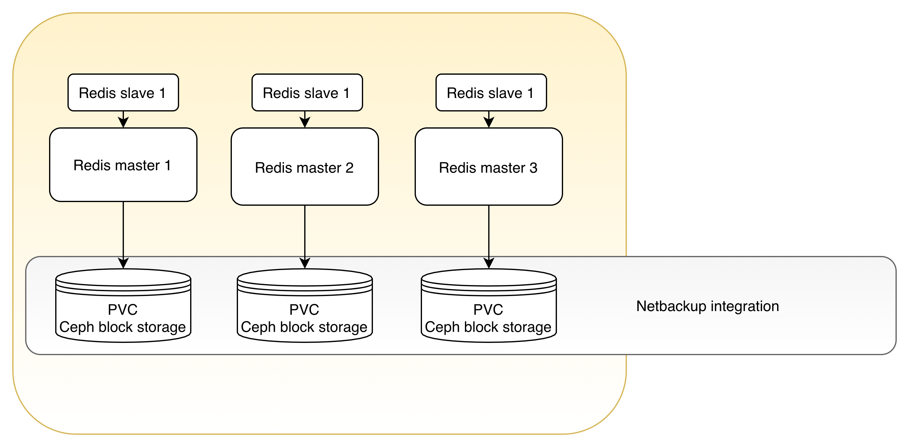

# Backup Configuration

## Backup procedure

Redis Operator configures full RDB backup to run every 15 minutes if there is at least one change. RDB backup should be uploaded to S3 with a Cronjob process for each node.

RDB file is recorded under `/data/dump.rdb`.

## Restore procedure

Currently, there is no automated restore procedure. It's advised to manually fetch the required RDB or AOF file and run a restore procedure.

## Nodes layout

