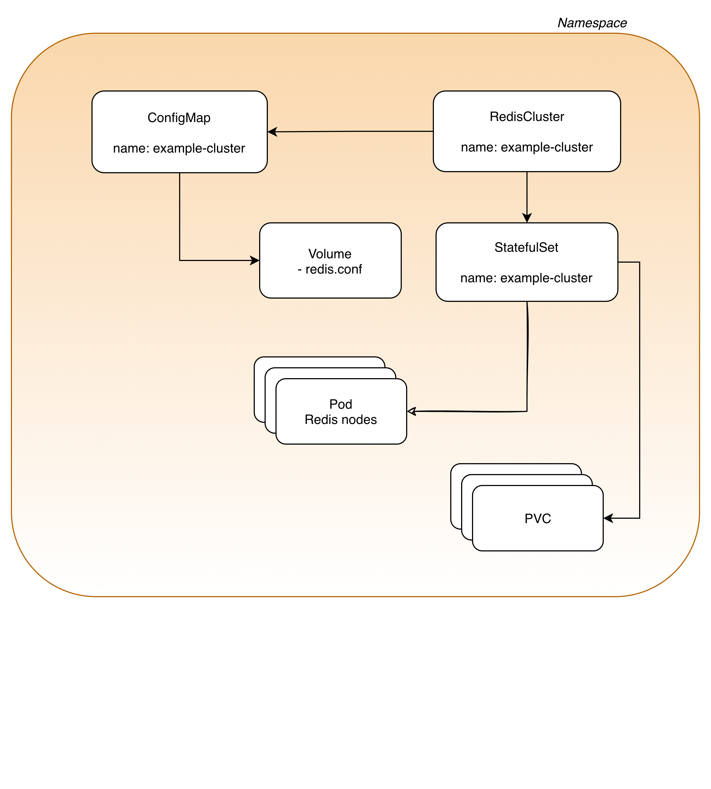

# How to deploy a Redis Cluster

## CRD

RedKey operator CRD defines a new resource type `RedKeyCluster`.

Below you'll find an example of manifest conforming to the resource definition that will deploy a RedKey cluster:

```yaml
apiVersion: redis.inditex.dev/v1
kind: RedKeyCluster
metadata:
  name: rediscluster-sample
  namespace: default
  labels:
    app: redis
    team: team-a
spec:
  labels:
    redis-name: rediscluster-sample
    app: myapp
  replicas: 3
  storage: 3Gi
  image: redislabs/redisgraph:2.8.9
  resources:
    limits:
      cpu: 1
      memory: 2Gi
  config: |
    save ""
    appendonly no
    maxmemory 1400mb
  robin:
    template:
      spec:
        containers:
        - name: robin
          image: redis-metrics:1.0.0
          ports:
          - containerPort: 8080
            name: prometheus
            protocol: TCP
          volumeMounts:
          - mountPath: /opt/conf/configmap
            name: rediscluster-sample-robin-config
        volumes:
        - configMap:
            defaultMode: 420
            name: rediscluster-sample-robin
          name: rediscluster-sample-robin-config
```

### Redis configuration

The `config` item contains the Redis specific configuration attributes that are usually set in the `redis.conf` Redis configuration file (you'll find a complete self-documented [redis.conf](https://redis.io/docs/management/config-file/) file in Redis documentation).


## Cluster vs Standalone

Currently, RedKey operator **only deploys Rdis in cluster mode**.

However, it's possible to set `replicas: 1` to deploy a single instance RedKey cluster. With this configuration, all the slots will be by force allocated to that instance.

## Live reloading

The configuration from `config` item will be placed under a ConfigMap created and managed by the Operator. This ConfigMap shares its name with the RedisCluster.

The configuration contained in this ConfigMap is the `source of truth` that RedKey operator will use to create and configure the RedKey cluster nodes.

Config reloading is supported by RedKey operator. When ConfigMap contents are updated RedKey operator's reconciliation loop will detect it and update the underlying mapping upgrading the RedKey cluster and restarting the Redis nodes to get the new configuration.

## Resources layout


