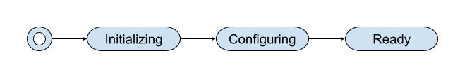
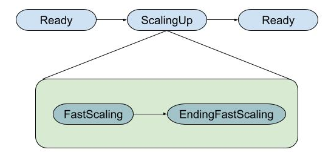
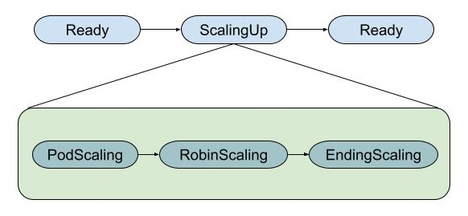
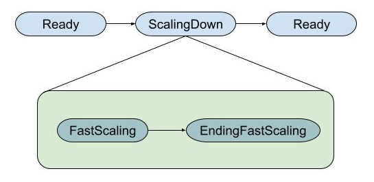
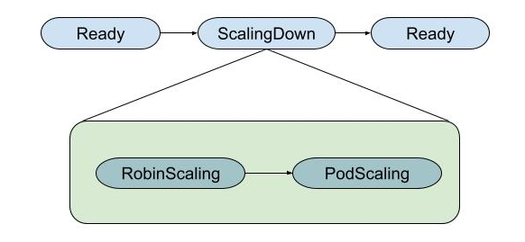
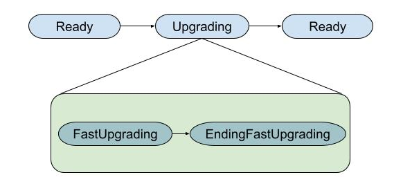
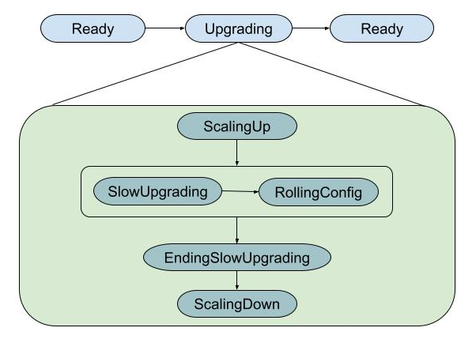

# Redkey Cluster Status and Substatus

Status codes is used to know the state of a Redis cluster.

The implemented status are:

- **Initializing**: The necessary Kubernetes objects have been created (primarily a StatefulSet, which manages the pods on the Redis nodes, and Redkey Robin Deployment). The operator is waiting for all the pods to be ready and Robin to start responding.
- **Configuring**: Robin is responsible for building the cluster, performing the necessary meets between all nodes, assigning slots to ensure everyone is covered, and making sure the cluster is balanced. The operator waits for Robin to confirm that the cluster is ready.
- **Ready**: The cluster has the correct configuration, the desired number of primaries and replicas per primary, is rebalanced and ready to be used. The Redis clusters health in this status will be checked by the Operador periodically asking their Robin services.
- **Upgrading**: The cluster is being upgraded, reconfiguring the objects to solve the mismatches. A RedkeyCluster enters this status when when:
  - there are differences between the existing configuration in the configmap and the configuration of the RedkeyCluster object merged with the default configuration set in the code.
  - there is a mismatch between the StatefulSet object labels and the RedkeyCluster Spec labels.
  - a mismatch exists between RedkeyCluster resources defined under spec and effective resources defined in the StatefulSet.
  - the images set in RedkeyCluster under spec and the image set in the StatefulSet object are not the same.
- **ScalingDown**: The cluster enters in this status to remove excess nodes. RedkeyCluster nodes (primaries * replicas per primary) > StatefulSet replicas.
- **ScalingUp**: The cluster enters in this status to create the needed nodes to equal the desired nodes with the current nodes. RedkeyCluster primaries * replicas per primary < StatefulSet replicas.
- **Error**: An error is detected in the cluster. The operator tries to recover the cluster from error checking the configuration and/or scaling the cluster.
  - Storage capacity mismatch.
  - Storage class mismatch.
  - Scaling up the cluster before upgrading raises an error.
  - Scaling down the cluster after upgradind raises an error.
  - Scaling up when in StatusScalingUp status goes wrong.
  - Scaling down when in StatusScalingDown status goes wrong.

See [Redkey Robin](./redkey-robin.md) for more details.

## Redkey Cluster creation Status transitions

The status flow in creating a new Redkey Cluster is as simple as this:



The following is an example of the sequence of states that we can see when deploying the sample Redkey Cluster* (command `kubectl get rkcl -w`):

```
NAME                      PRIMARIES   REPLICAS   EPHEMERAL   PURGEKEYS   IMAGE              STORAGE   STATUS       SUBSTATUS
redis-cluster-ephemeral   3           0          true        true        redis:8-bookworm                      
redis-cluster-ephemeral   3           0          true        true        redis:8-bookworm             Initializing   
redis-cluster-ephemeral   3           0          true        true        redis:8-bookworm             Configuring    
redis-cluster-ephemeral   3           0          true        true        redis:8-bookworm             Configuring    
redis-cluster-ephemeral   3           0          true        true        redis:8-bookworm             Ready 
```

\* The sample Redkey Cluster can be deployed from the project code by executing `make apply-rkcl`.

## Substatus

To provide more detail about scaling and upgrade operations, a series of Substatus fields have been added to the ScalingUp, ScalingDown, and Upgrading status fields. This allows you to see the current stage of the operation for the cluster.

The Substatus that will be applied to these operations will depend on the Redkey Cluster configuration parameter [**purgeKeysOnRebalance**](./purge-keys-on-rebalance.md), which will determine whether the operations are executed with or without key loss.

### Redkey Cluster Scaling Up (Fast scaling)

Two Substatus are defined:

* **FastScaling**: The StatefulSet is recreated and we wait for the new Redkey Cluster pods to be ready.
* **EndingFastScaling**: The Operator asks Robin to recreate the cluster and waits for confirmation that it has been recreated correctly, covering all slots and remaining balanced.



This is an example of the Status and SubStatus changes when scaling the sample Redkey Cluster from 3 to 5 primaries:


```
NAME                      PRIMARIES   REPLICAS   EPHEMERAL   PURGEKEYS   IMAGE              STORAGE   STATUS   SUBSTATUS
redis-cluster-ephemeral   3           0          true        true        redis:8-bookworm             Ready    
redis-cluster-ephemeral   5           0          true        true        redis:8-bookworm             Ready    
redis-cluster-ephemeral   5           0          true        true        redis:8-bookworm             ScalingUp   
redis-cluster-ephemeral   5           0          true        true        redis:8-bookworm             ScalingUp   FastScaling
redis-cluster-ephemeral   5           0          true        true        redis:8-bookworm             ScalingUp   EndingFastScaling
redis-cluster-ephemeral   5           0          true        true        redis:8-bookworm             Ready 
```

### Redkey Cluster Scaling Up (Slow scaling)

Three Substatus are defined:

* **PodScaling**: The StatefulSet is updated to create the new required pods. The Operator waits for pods readiness.
* **RobinScaling**: All the pods are now ready and Robin is required to scale the Redkey Cluster to the new size. The Operator keeps waiting for Robin confirming the cluster is scaled. 
* **EndingScaling**: Robin ensures the health of the cluster and rebalances the slots.



This is an example of the Status and SubStatus changes when scaling the sample Redkey Cluster from 3 to 5 primaries, having previously changed the `purgeKeysOnRebalance` parameter to **false**:

```
NAME                      PRIMARIES   REPLICAS   EPHEMERAL   PURGEKEYS   IMAGE              STORAGE   STATUS   SUBSTATUS
redis-cluster-ephemeral   3           0          true        false       redis:8-bookworm             Ready    
redis-cluster-ephemeral   5           0          true        false       redis:8-bookworm             Ready    
redis-cluster-ephemeral   5           0          true        false       redis:8-bookworm             ScalingUp   
redis-cluster-ephemeral   5           0          true        false       redis:8-bookworm             ScalingUp   PodScaling
redis-cluster-ephemeral   5           0          true        false       redis:8-bookworm             ScalingUp   RobinScaling
redis-cluster-ephemeral   5           0          true        false       redis:8-bookworm             ScalingUp   EndingScaling
redis-cluster-ephemeral   5           0          true        false       redis:8-bookworm             Ready 
```

### Redkey Cluster Scaling Down (Fast scaling)

In this case, the same SubStatus rules apply as for the Fast Scaling Up operation.

* **FastScaling**
* **EndingFastScaling**



This is an example of the Status and SubStatus changes when scaling the sample Redkey Cluster from 5 to 3 primaries:

```
NAME                      PRIMARIES   REPLICAS   EPHEMERAL   PURGEKEYS   IMAGE              STORAGE   STATUS   SUBSTATUS
redis-cluster-ephemeral   5           0          true        true        redis:8-bookworm             Ready    
redis-cluster-ephemeral   3           0          true        true        redis:8-bookworm             Ready    
redis-cluster-ephemeral   3           0          true        true        redis:8-bookworm             ScalingDown   
redis-cluster-ephemeral   3           0          true        true        redis:8-bookworm             ScalingDown   FastScaling
redis-cluster-ephemeral   3           0          true        true        redis:8-bookworm             ScalingDown   EndingFastScaling
redis-cluster-ephemeral   3           0          true        true        redis:8-bookworm             Ready 
```

### Redkey Cluster Scaling Down (Slow scaling)

Two Substatus are defined:

* **RobinScaling**: The Operator requests Robin to descale the cluster, moving the slots (and keys) from the exceeding nodes to those that will be maintained.
* **PodScaling**: Robin has confirmed that the cluster has been scaled and rebalanced. The operator is now updating the StatefulSet to remove the excess pods.



This is an example of the Status and SubStatus changes when scaling the sample Redkey Cluster from 5 to 3 primaries, having previously changed the `purgeKeysOnRebalance` parameter to **false**:

```
NAME                      PRIMARIES   REPLICAS   EPHEMERAL   PURGEKEYS   IMAGE              STORAGE   STATUS   SUBSTATUS
redis-cluster-ephemeral   5           0          true        false       redis:8-bookworm             Ready    
redis-cluster-ephemeral   3           0          true        false       redis:8-bookworm             Ready    
redis-cluster-ephemeral   3           0          true        false       redis:8-bookworm             ScalingDown   
redis-cluster-ephemeral   3           0          true        false       redis:8-bookworm             ScalingDown   RobinScaling
redis-cluster-ephemeral   3           0          true        false       redis:8-bookworm             ScalingDown   PodScaling
redis-cluster-ephemeral   3           0          true        false       redis:8-bookworm             Ready  
```

### Redkey Cluster Upgrading (Fast upgrading)

Two Substatus are defined:

* **FastUpgrading**: The StatefulSet is recreated and we wait for the new Redkey Cluster pods to be ready.
* **EndingFastUpgrading**: The Operator asks Robin to recreate the cluster and waits for confirmation that it has been recreated correctly, covering all slots and remaining balanced.



This is an example of the Status and SubStatus changes when upgrading the sample Redkey Cluster:

```
NAME                      PRIMARIES   REPLICAS   EPHEMERAL   PURGEKEYS   IMAGE              STORAGE   STATUS   SUBSTATUS
redis-cluster-ephemeral   3           0          true        true        redis:8-bookworm             Ready    
redis-cluster-ephemeral   3           0          true        true        redis:8-bookworm             Upgrading   
redis-cluster-ephemeral   3           0          true        true        redis:8-bookworm             Upgrading   FastUpgrading
redis-cluster-ephemeral   3           0          true        true        redis:8-bookworm             Upgrading   EndingFastUpgrading
redis-cluster-ephemeral   3           0          true        true        redis:8-bookworm             Ready  
```

### Redkey Cluster Upgrading (Slow upgrading)

These SubStatus have been defined:

* **ScalingUp**: The Operator add one pod that is added as a Master node to the Redkey Cluster. This node will be used to move slots from the existing nodes before recreating them.
* **SlowUpgrading**: A node is being empty, moving all its slots (and keys) to another node.
* **RollingConfig**: The empty node is being recreated, recreating its pod and asking to Robin to refresh the cluster.
* **EndingSlowUpgrading**: Move the slots (and keys) from the extra node.
* **ScalingDown**: The extra node added to the cluster is removed.

When Slow upgrading a Redkey Cluster the upgrade is executed from partition to partition, aaplying the **SlowUpgrading** and **RollingConfig** SubStatus to each partition.

Current partition can be shown using `kubectl get rkcl -o wide`.



This is an example of the Status and SubStatus changes when upgrading the sample Redkey Cluster, having previously changed the `purgeKeysOnRebalance` parameter to **false**:

```
NAME                      PRIMARIES   REPLICAS   EPHEMERAL   PURGEKEYS   IMAGE              STORAGE   STORAGECLASSNAME   DELETEPVC   STATUS   SUBSTATUS   PARTITION
redis-cluster-ephemeral   3           0          true        false       redis:8-bookworm                                            Ready                
redis-cluster-ephemeral   3           0          true        false       redis:8-bookworm                                            Ready                
redis-cluster-ephemeral   3           0          true        false       redis:8-bookworm                                            Upgrading               
redis-cluster-ephemeral   3           0          true        false       redis:8-bookworm                                            Upgrading   ScalingUp   
redis-cluster-ephemeral   3           0          true        false       redis:8-bookworm                                            Upgrading   SlowUpgrading   
redis-cluster-ephemeral   3           0          true        false       redis:8-bookworm                                            Upgrading   SlowUpgrading   
redis-cluster-ephemeral   3           0          true        false       redis:8-bookworm                                            Upgrading   SlowUpgrading   3
redis-cluster-ephemeral   3           0          true        false       redis:8-bookworm                                            Upgrading   RollingConfig   3
redis-cluster-ephemeral   3           0          true        false       redis:8-bookworm                                            Upgrading   SlowUpgrading   2
redis-cluster-ephemeral   3           0          true        false       redis:8-bookworm                                            Upgrading   SlowUpgrading   2
redis-cluster-ephemeral   3           0          true        false       redis:8-bookworm                                            Upgrading   SlowUpgrading   2
redis-cluster-ephemeral   3           0          true        false       redis:8-bookworm                                            Upgrading   RollingConfig   2
redis-cluster-ephemeral   3           0          true        false       redis:8-bookworm                                            Upgrading   RollingConfig   2
redis-cluster-ephemeral   3           0          true        false       redis:8-bookworm                                            Upgrading   SlowUpgrading   1
redis-cluster-ephemeral   3           0          true        false       redis:8-bookworm                                            Upgrading   SlowUpgrading   1
redis-cluster-ephemeral   3           0          true        false       redis:8-bookworm                                            Upgrading   RollingConfig   1
redis-cluster-ephemeral   3           0          true        false       redis:8-bookworm                                            Upgrading   RollingConfig   1
redis-cluster-ephemeral   3           0          true        false       redis:8-bookworm                                            Upgrading   SlowUpgrading   0
redis-cluster-ephemeral   3           0          true        false       redis:8-bookworm                                            Upgrading   RollingConfig   0
redis-cluster-ephemeral   3           0          true        false       redis:8-bookworm                                            Upgrading   EndingSlowUpgrading   0
redis-cluster-ephemeral   3           0          true        false       redis:8-bookworm                                            Upgrading   EndingSlowUpgrading   0
redis-cluster-ephemeral   3           0          true        false       redis:8-bookworm                                            Upgrading   ScalingDown           0
redis-cluster-ephemeral   3           0          true        false       redis:8-bookworm                                            Ready    
```
