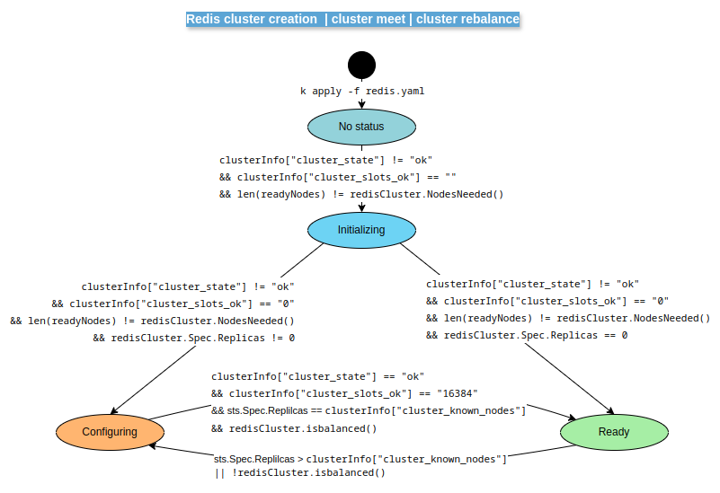
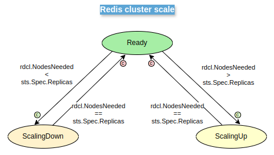
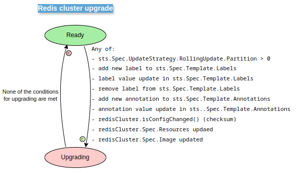
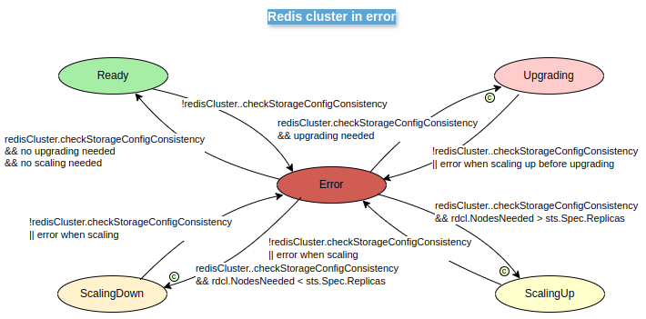

# Redis cluster status

Status codes is used to know the state of a Redis cluster.

The implemented status are:

- **Upgrading**: The cluster is upgraded, reconfiguring the objects to solve the mismatches. A RedKeyCluster enters this status when when:
  - there are differences between the existing configuration in the configmap and the configuration of the RedKeyCluster object merged with the default configuration set in the code.
  - there is a mismatch between the StatefulSet object labels and the RedKeyCluster Spec labels.
  - a mismatch exists between RedKeyCluster resources defined under spec and effective resources defined in the StatefulSet.
  - the images set in RedKeyCluster under spec and the image set in the StatefulSet object are not the same.
- **ScalingDown**: The cluster enters in this status to remove excess nodes. RedKeyCluster replicas > StatefulSet replicas.
- **ScalingUp**: The cluster enters in this status to create the needed nodes to equal the desired replicas with the current replicas. RedKeyCluster replicas < StatefulSet replicas.
- **Ready**: The cluster has the correct configuration, the desired number of replicas, is rebalanced and ready to be used. The Redis clusters in this status will be checked by the Operador periodically.
- **Configuring**: Not all the cluster slots are OK but every cluster node are up and ready. If the cluster needs a meet or a rebalance, being in Ready status, its status will switch to Configuring.
- **Initializing**: Not all the cluster slots are OK and not all the cluster nodes are up and ready.
- **Error**: An error is detected in the cluster. The operator tries to recover the cluster from error checking the configuration and/or scaling the cluster.
  - Storage capacity mismatch.
  - Storage class mismatch.
  - Scaling up the cluster before upgrading raises an error.
  - Scaling down the cluster after upgradind raises an error.
  - Scaling up when in StatusScalingUp status goes wrong.
  - Scaling down when in StatusScalingDown status goes wrong.

### Status transitions: Redis cluster creation, cluster meet, cluster rebalance

### Status transitions: Redis cluster scale

### Status transitions: Redis cluster upgrade

### Status transitions: Redis cluster in error

