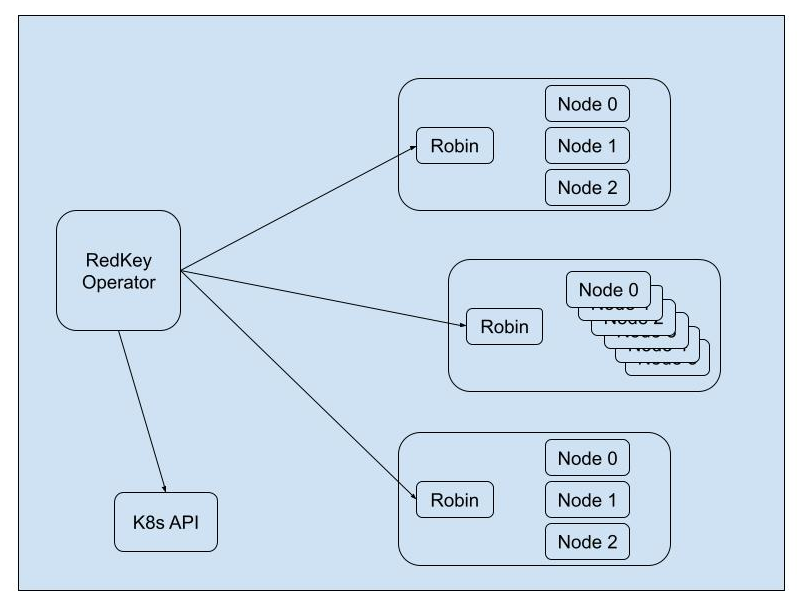

# RedKey Robin

*Robin, the faithful companion that every RedKey Cluster has by its side.*

To simplify the RedKey Operator's operations and separate Redis specific management from Kubernetes management, RedKey Robin has been integrated into the architecture.

The Operator is responsible for managing the RedKey cluster lifecycle and directly managing Kubernetes objects, while Robin handles all Redis operations.

When a new RedKey Cluster is created, the Operator creates a Deployment that is responsible for deploying the Robin pod. Therefore, there will always be a Robin pod associated with a RedKey Cluster.

Robin takes care of the cluster, performing periodic checks to ensure that all nodes are healthy, the cluster is well-formed, all slots are covered, and the cluster is properly balanced.

Changes made to the RedKeyCluster object, managed directly by the Operator, such as changes in the number of replicas that involve scaling the cluster or changes in the configuration that require upgrading the cluster, are reported by the Operator to Robin through the API that the latter exposes.

Additionally, Robin exposes an endpoint to retrieve metrics from the RedKey Cluster. It performs periodic polling of cluster data to ensure the data is always up-to-date.

The following diagram shows how the Operator makes calls to the Kubernetes API and to the API of each of the Robins of the RedKey Clusters it manages.

See the docs in the [RedKey Robin GitHub repository](https://github.com/InditexTech/redkeyrobin) for more details.